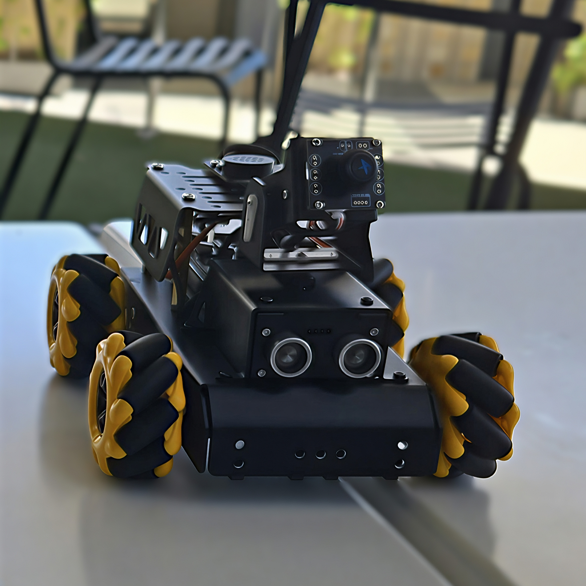

# LUNA — TurboPi Intelligent Robot


> Raspberry Pi robotics platform integrating Flask control, OpenCV vision, WonderEcho voice commands, line-following, ball-tracking, and PID-style tuning.

## Overview

LUNA is a Raspberry Pi-based intelligent robot built on the Hiwonder TurboPi platform. The project combines hardware assembly, Python programming, wireless control, computer vision, voice interaction, and movement tuning into one integrated robotics system.

This repository is a sanitized portfolio version of a two-person university robotics project. It's structured as a technical case study covering design decisions, implementation details, and engineering challenges.

**Demo video:** https://youtu.be/RrAcwlQjl2Y

## Key Features

- Raspberry Pi-based robot control system
- Flask server for wireless command routing
- Tkinter-based desktop control interface
- WonderEcho offline voice-control integration using I²C
- Camera-based line-following (integration with Hiwonder VisualPatrol.py via subprocess control)
- OpenCV-based coloured ball-following using LAB colour detection and PID tracking
- PID-style fine-tuning for smoother autonomous movement
- Mecanum-wheel movement: forward, backward, turning, and strafing
- Hardware troubleshooting and physical robot integration
- Ultrasonic crash guard for forward movement safety

## Technology Stack

| Area | Technologies |
|---|---|
| Hardware | Raspberry Pi 4B, Hiwonder TurboPi, mecanum wheels, camera module, WonderEcho module, ultrasonic sensor |
| Programming | Python |
| Web/control layer | Flask |
| Computer vision | OpenCV, NumPy |
| Interface | Tkinter |
| Communication | I²C, GPIO, HTTP endpoints |
| Robotics/control | PID-style tuning, motor control, servo/gimbal control |

## My Contributions

This project was completed collaboratively by **Bharath "Barry" Sampath** and **Zhirui Lu**.

My main contributions:

- Sourced and maintained the TurboPi robot hardware throughout the project
- Raspberry Pi communication and hardware-control integration
- WonderEcho voice-control integration — I²C command reading, ID mapping, debounce logic, and movement triggering
- Line-following integration controller: voice-triggered subprocess management for Hiwonder's VisualPatrol.py
- Hardware assembly, robot setup, component mounting, and hands-on troubleshooting (including diagnosing and resolving a motor/wheel failure)
- Flask control app collaboration and command-routing workflow support
- PID-style fine-tuning after the initial PID implementation by Zhirui Lu
- Project documentation, technical explanation, and final presentation support

→ Full breakdown: [docs/contribution-statement.md](docs/contribution-statement.md)

## Documentation

| Document | Description |
|---|---|
| [Project Overview](docs/project-overview.md) | High-level explanation of LUNA, project purpose, and key capabilities |
| [System Architecture](docs/system-architecture.md) | How the Raspberry Pi, software, sensors, camera, and hardware connect |
| [Contribution Statement](docs/contribution-statement.md) | Individual and collaborative contribution breakdown |
| [WonderEcho Voice Control](docs/wonderecho-voice-control.md) | Offline voice-control integration using I²C |
| [Line-Following System](docs/line-following.md) | WonderEcho integration controller for pathway-following behaviour |
| [Ball-Tracking System](docs/ball-tracking.md) | LAB colour detection, PID gimbal control, and chassis following |
| [PID-Style Tuning](docs/pid-tuning.md) | Tuning process and control parameters for smoother autonomous movement |
| [Testing and Results](docs/testing-and-results.md) | Subsystem testing and final project results |
| [Challenges and Solutions](docs/challenges-and-solutions.md) | Hardware, software, and integration problems encountered and resolved |
| [Future Improvements](docs/future-improvements.md) | Possible next steps and project extensions |

## Repository Structure

```text
docs/          Technical documentation and project write-ups
media/         Project photos, diagrams, screenshots, and demo visuals
src/           Selected and sanitized source code modules
```

## Source Code

Code is organised into focused modules. Files are being added progressively as each one is cleaned and reviewed.

```text
src/
├── control_app/        Tkinter desktop control interface ✓
├── flask_server/       Flask server and robot command routing ✓
├── voice_control/      WonderEcho snapshot controller ✓
├── vision_tracking/    Ball-tracking and OpenCV code ✓
├── line_following/     WonderEcho line-following integration controller ✓
└── safety_guard/       Ultrasonic crash guard for forward movement ✓
```

## Setup

```bash
pip install -r requirements.txt
```

The TurboPi SDK (HiwonderSDK, Camera, yaml_handle) must be installed separately on the Raspberry Pi. See the [Hiwonder TurboPi documentation](https://wiki.hiwonder.com/projects/TurboPi/en/standard/index.html) for setup.

## Third-Party Components

The TurboPi platform and associated SDK components (HiwonderSDK, VisualPatrol.py, Camera, yaml_handle) are products of [Hiwonder](https://www.hiwonder.com). This repository does not reproduce or redistribute their proprietary SDK. References to SDK paths and function calls are included only to document integration work.
