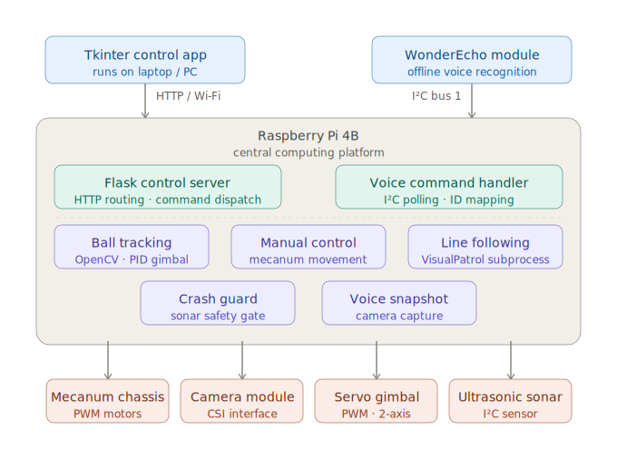

# System Architecture

LUNA is built as an integrated robotics system where the Raspberry Pi acts as the central computing platform. It coordinates communication between the control software, robot hardware, camera module, WonderEcho voice module, motors, servos, and sensors.

## High-Level Architecture

The system can be understood as four main layers:

1. User interaction layer
2. Software control layer
3. Hardware communication layer
4. Physical robot movement layer

## 1. User Interaction Layer

LUNA supports multiple ways for a user to interact with the robot:

- Desktop control interface for manual movement
- WonderEcho voice commands for hands-free control
- Camera-based behaviours for line-following and ball-following

These inputs allow the robot to respond to both direct user commands and sensor-based environmental information.

## 2. Software Control Layer

The software control layer is mainly written in Python. It includes:

- Flask server for receiving and routing control commands
- Python control scripts for movement behaviour
- OpenCV-based vision processing
- Voice-control command handling
- PID-style tuning logic for smoother autonomous movement

The Flask server helps separate user commands from hardware actions. This makes the system easier to manage because commands can be routed through clear endpoints instead of directly controlling hardware from multiple places.

## 3. Hardware Communication Layer

The Raspberry Pi communicates with different robot components using hardware communication methods such as:

- I²C communication for the WonderEcho voice-control module
- GPIO / expansion board communication for robot hardware control
- Camera input for visual processing
- Motor and servo control through the TurboPi / Hiwonder hardware platform

This layer is important because it connects the software logic to the physical robot components.

## 4. Physical Robot Movement Layer

The robot uses a mecanum-wheel chassis, allowing it to move in multiple directions, including:

- Forward
- Backward
- Turning left and right
- Strafing left and right

This movement system gives LUNA more flexibility than a basic two-wheel robot because it can move sideways and adjust position more smoothly.

## Core Data Flow



```text
User / Sensor Input
        ↓
Python Control Logic
        ↓
Flask Server / Voice Command Handler / Vision Processing
        ↓
Raspberry Pi Communication Layer
        ↓
TurboPi Hardware + Motors + Servos
        ↓
Robot Movement / Camera Alignment / Physical Response
```
## Main System Components
| Component              | Role                                                   |
| ---------------------- | ------------------------------------------------------ |
| Raspberry Pi 4B        | Main computing and control platform                    |
| TurboPi robot platform | Robot chassis, motor control, and hardware integration |
| Flask server           | Routes movement and control commands                   |
| Tkinter control app    | Provides manual control interface                      |
| WonderEcho module      | Enables offline voice command input                    |
| Camera module          | Provides input for line-following and ball-tracking    |
| OpenCV                 | Processes camera frames for visual detection           |
| Mecanum wheels         | Enable multidirectional movement                       |
| Ultrasonic sensor      | Supports forward safety / crash-guard behaviour        |


## Design Approach

The system was designed to combine manual control, voice interaction, and camera-based autonomous behaviour into one robot platform. Instead of treating each feature as a separate experiment, the project aimed to integrate them into a single working robot system.

This architecture demonstrates practical embedded systems thinking because it connects software control, hardware communication, sensors, actuators, and real-world testing into one complete project.
